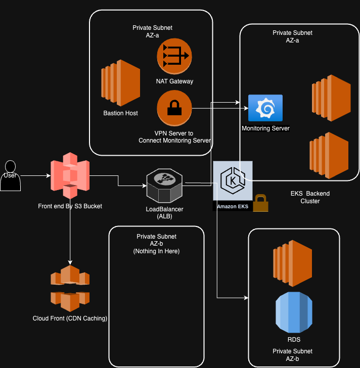
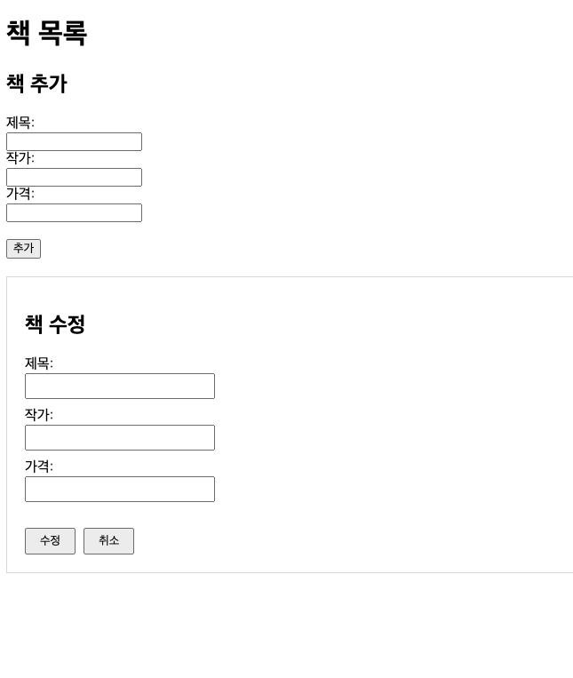

# HW

# Project Stacks
## AWS 리소스 구성 with Terraform
- **EKS (Elastic Kubernetes Service)**: 백엔드가 배포된 쿠버네티스 클러스터 관리
- **RDS (Relational Database Service)**: 프라이빗 서브넷에 MySQL 데이터베이스를 배포
- **S3 및 CloudFront**: 프론트엔드 정적 사이트 호스팅, CDN 
- **NAT 게이트웨이 및 인터넷 게이트웨이**: 프라이빗 서브넷 리소스가 인터넷에 접근할 수 있도록 라우팅
- **IAM**: 리소스 접근을 위한 역할과 정책 구성

## VPC 구성
- **서브넷**: 퍼블릭 서브넷 2개와 프라이빗 서브넷 2개로 구성, RDS와 EKS 노드 프라이빗 서브넷에 배치
- **NAT 및 인터넷 게이트웨이**: 퍼블릭 서브넷에서 NAT 게이트웨이를 통해 프라이빗 서브넷 리소스가 외부 인터넷에 접근 가능

## IaC (Infrastructure as Code)
- **도구**: Terraform 사용
- **모듈화 구성**: VPC, EKS, RDS, S3 등 주요 리소스를 모듈로 구성, tfvars 최대한 활용하여 반복 자동화

## 쿠버네티스 (k8s)
- **Helm 차트**: Helm차트 이용했습니다.
- **오토스케일링 설정**: HorizontalPodAutoscaler(HPA)로 오토스케일링 구성 (초기 복제본 수 2개, 최소 1개, 최대 3개)

## 모니터링 및 접근 보안
- **Grafana 모니터링**: 모니터링용 Grafana서버
- **Prometheus**: Node Exporter 사이드카 배포, 각 노드의 메트릭을 수집
- **OpenVPN**: Grafana와 Prometheus 대시보드에 접근하게끔 퍼블릭 서브넷에 OpenVPN 서버 설정. OpenVPN IAM이미지 사용했음.
  - **접근 방식**: 외부 사용자가 VPN 클라이언트를 설치해서 OpenVPN서버에 연결하면 VOC에 접근 가능함

## 프로젝트로 구현한 내용
책 목록 CRUD기능을 구현하고, 이 비즈니스 로직이 동작하는 인프라 환경을 MSA로 구현했습니다. (프로젝트명 bookstore)

## 아키텍처

---

전반적인 아키텍처 설명입니다.

1. 최소기능의 프런트엔드를 구현했습니다. 이용자는 CloudFront와 연결돼있는 S3버킷을 통해 정적 파일에 접근할 수 있습니다.
2. VPC구성:
   1. Public Subnet: NAT Gateway, Bastion Host, VPN Server, Loadbalancer
   2. Private Subnet: Worker Nodes(Backends), RDS
3. 백엔드는 EKS클러스터로 배포돼있으며, 서비스 타입은 로드밸런서입니다.
4. 이 클러스터의 워커노드는 desired count=2, min=1, max=3으로 스케일링되게끔 설정돼 있습니다.
5. 모니터링서버에 grafana-prometheus가 간단하게 설정돼있습니다. 백엔드 이미지의 side-car로 prometheus node-exporter를 배포했고, 아주 간단한 메트릭만 수집하게끔 배포했습니다. (실제로 메트릭 수집 설정 yaml파일 작성은 진행하지 않았고, 인프라 프로비저닝까지는 헀습니다.)
6. OpenVPN AMI를 구독하고, vpn서버를 통해야 모니터링서버에 접근할 수 있게끔 했습니다.
7. BastionHost를 두어, 백엔드 어플리케이션 vpc에 진입할 수 있게끔 했습니다.

순서대로 설명하겠습니다.

## 최소 기능 프런트엔드

---

프런트엔드는 과제의 요구사항은 아니었지만, CRUD를 클라이언트쪽에서 호출하는 로직이 실제 서비스 상황과 보다 유사할 것 같아서 간단하게나마 작성했습니다.

폴더 구조는 위와 같고, 직관적으로 CRUD 비즈니스로직 엔드포인트를 호출할 수 있게끔 했습니다.

여기서, API_URL은 배포 환경에서는 k8s 로드밸런서 서비스의 DNS로 바꿔 주어야 합니다.

S3버킷에 배포하고, CloudFront에 연동하여 이 버킷의 퍼블릭 액세스 허용-액세스 엔드포인트 생성-CloudFront통합 배포 순으로하여 접근할 수 있습니다.

리소스의 프로비저닝 과정은 S3.tf에 작성해 두었습니다.

## VPC구성에 대한 설명

---

- 두 가용영역(a, b)를 이용하였으며, 각각 프라이빗 서브넷과 퍼블릭 서브넷이 존재합니다.
  - EKS클러스터는 두 가용영역 내 프라이빗 서브넷에서 스케일링할 수 있습니다.
- Private Subnet:백엔드, DB 등의 비즈니스 로직이 포함된 리소스는 프라이빗 서브넷에 프로비저닝해 퍼블릭 액세스를 막는 것이 일반적인 접근입니다. VPC 내 프라이빗 서브넷에 비즈니스 로직이 배포돼 있습니다. 또, 모니터링 서버도 배포해서 클러스터 내 메트릭을 수집하고, grafana로 시각화합니다.
- Public Subnet: Bastion Host와 VPN서버가 프로비저닝 돼 있습니다. (VPN은 프라이빗 서브넷에 배포돼 있는 모니터링 서버를 운영자가 접근하기 위한 용도입니다.). 또, natgw가 배포돼 있는 것을 위 라우팅 리소스맵에서 보실 수 있습니다.
  

cluster의 백엔드와 (현재 scale==1이어서 1개입니다.) , 모니터링 서버는 프라이빗 서브넷에, 배스천 호스트와 vpn서버는 퍼블릭에 배포돼 있습니다.

## EKS클러스터(쿠버네티스)

---

hpa로 desired=2, min=1, max=3으로 스케일링되게끔 설정했습니다.

사용된 백엔드 이미지와 도커파일 등은 작성한 helm차트와 yaml파일에서 확인하실 수 있습니다.

인프라 프로비저닝은 마찬가지로 terraform으로 수행했습니다. 비밀 관련된 부분은, base-64로 인코딩해서 제출했습니다. 원래는 kubectl create configmap backend-config --from-env-file=.env과 같이, yaml이 아닌 ad-hoc방식으로 비밀을 관리하는 것이 더 안전하다고 생각해서 이렇게 하는데, 일단 가독성을 위해서 db-secret.yaml을 작성해서 레포지토리에 올려두었습니다.

## 백엔드 이미지 설명

---

간단한 CRUD를 구현했습니다. 깃허브에서 확인하실 수 있고, 환경 변수는 아래와 같이 .env에 서 참조될 수 있게끔 하여 소스코드에 비밀이 누출되는 것을 막고, 환경변수 파일을 통해서 DB엔드포인트를 유동적으로 조절할 수 있게끔 했습니다.

## DB Instance (RDS)

---

Mysql 기반의 RDS입니다.

DB 스키마는 다음과 같습니다.
id INT AUTO_INCREMENT PRIMARY KEY, title VARCHAR(255), author VARCHAR(255), price DECIMAL(10, 2)

## 모니터링 (Prometheus 및 Grafana)

---

클러스터 상태와 애플리케이션 성능 모니터링을 위해 Prometheus와 Grafana를 구성했습니다. Prometheus는 쿠버네티스 파드 내 Node Exporter 사이드카에서 메트릭을 수집하고, Grafana 대시보드에서 이를 시각화해 성능을 분석합니다. 시스템 자원 사용량과 요청 처리량을 쉽게 확인할 수 있어 문제 발생 시 원인 분석에 효과적입니다. (실제로 Prometheus 설정 yaml을 작성하지는 않았으나, deployment를 보시면 사이드카를 배포하긴 했습니다.)

## 보안 접근 (OpenVPN)

---

외부에서 안전하게 모니터링 대시보드에 접근할 수 있도록 OpenVPN을 퍼블릭 서브넷에 설정했습니다. 사용자는 OpenVPN클라이언트를 통해 프라이빗 네트워크에 접속해 Grafana와 Prometheus 대시보드에 접근할 수 있습니다. OpenVPN은 외부와 내부 네트워크 간 보안 터널을 제공하여 클러스터의 모니터링 시스템을 보호합니다. OpenVPN은 AWS marketplace의 이미지를 이용했습니다. 
